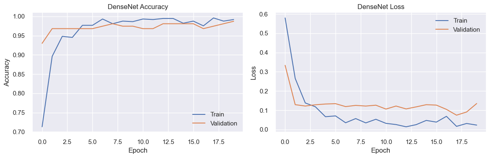
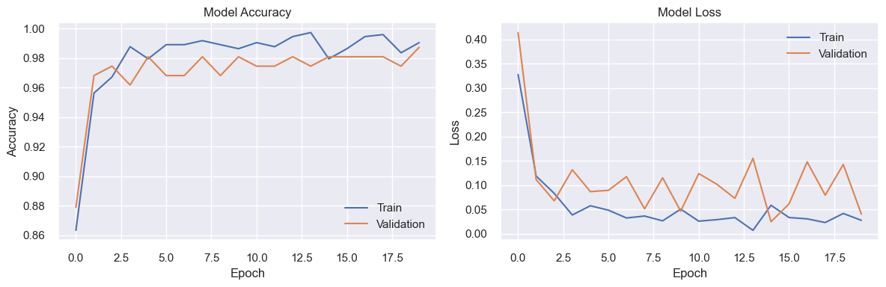
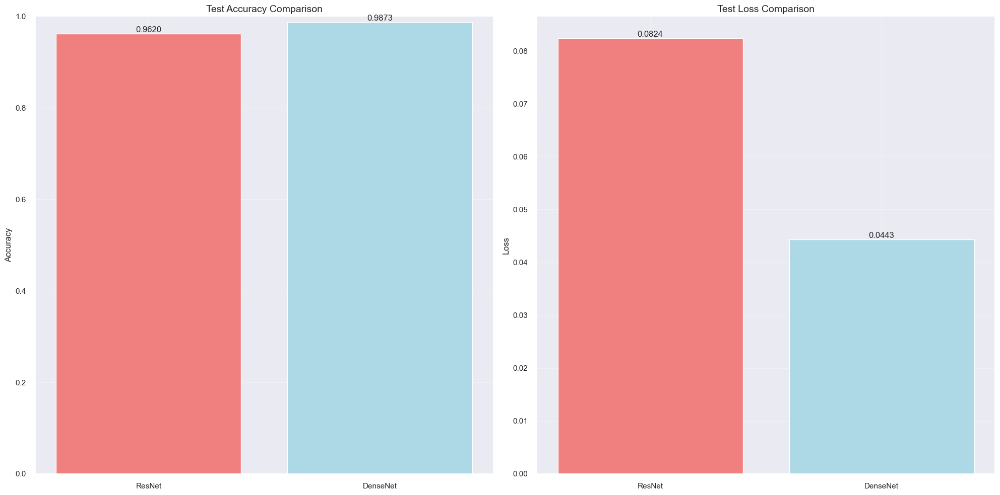

# Brain Tumor Classification

This project implements a deep learning model for brain tumor classification using PyTorch. The model is trained to classify brain MRI images into different categories of tumors.

## Dataset

The dataset consists of brain MRI images divided into two classes:
- Brain Glioma
- Brain Meningioma

The dataset is split into:
- Training set: 70% of data
- Validation set: 15% of data
- Test set: 15% of data

All images are standardized to 512x512 pixels.

## Model Architecture

The project implements two deep learning models:
- DenseNet
- ResNet

Both models are fine-tuned for the specific task of brain tumor classification.

### Training Parameters
- Image Size: 512x512
- Batch Size: 16
- Number of Epochs: 20
- Learning Rate: 0.0001
- Device: CUDA (GPU) if available, else CPU

## Requirements

- Python 3.x
- PyTorch
- torchvision
- matplotlib
- seaborn
- scikit-learn
- PIL
- pandas
- numpy

## Setup

1. Clone the repository:
```bash
git clone https://github.com/salahradwan2210/brain-tumor-classification.git
```

2. Install the required packages:
```bash
pip install torch torchvision matplotlib seaborn scikit-learn pillow pandas numpy
```

3. Run the Jupyter notebook:
```bash
jupyter notebook brain_tumor_classifier.ipynb
```

## Project Structure

- `brain_tumor_classifier.ipynb`: Main notebook containing the model implementation and training code
- `README.md`: Project documentation
- `.gitignore`: Git ignore file
- `train/`: Training dataset directory
- `val/`: Validation dataset directory
- `test/`: Test dataset directory
- `densenet_classifier.pth`: Trained DenseNet model weights
- `resnet_classifier.pth`: Trained ResNet model weights

## Model Training

The training process includes:
1. Data preprocessing and augmentation
2. Model architecture setup
3. Training with cross-entropy loss
4. Validation during training
5. Model checkpointing

## Results

The models are trained to classify brain tumors into two categories:
- Glioma
- Meningioma

### Model Performance

#### DenseNet Results

- Final Training Accuracy: ~99%
- Final Validation Accuracy: ~97%
- Final Training Loss: ~0.03
- Final Validation Loss: ~0.12

#### ResNet Results

- Final Training Accuracy: ~99%
- Final Validation Accuracy: ~98%
- Final Training Loss: ~0.03
- Final Validation Loss: ~0.10

#### Model Comparison


Performance comparison on test set:
- DenseNet:
  - Test Accuracy: 98.73%
  - Test Loss: 0.0443
- ResNet:
  - Test Accuracy: 96.20%
  - Test Loss: 0.0824

Key Observations:
- Both models show excellent performance with >96% accuracy
- DenseNet slightly outperforms ResNet on test data
- DenseNet shows better loss metrics on test set
- Both models demonstrate good convergence and minimal overfitting
- Training stabilizes after approximately 5 epochs

The trained models are saved as `.pth` files and can be used for inference on new brain MRI images.

## License

This project is open source and available under the MIT License. 
